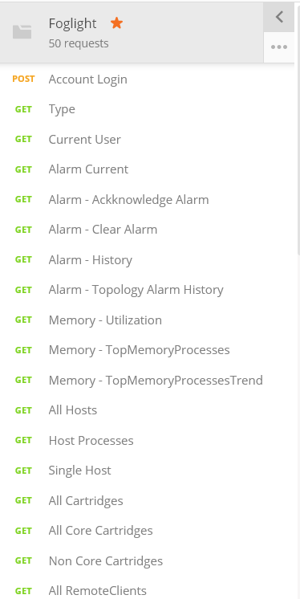
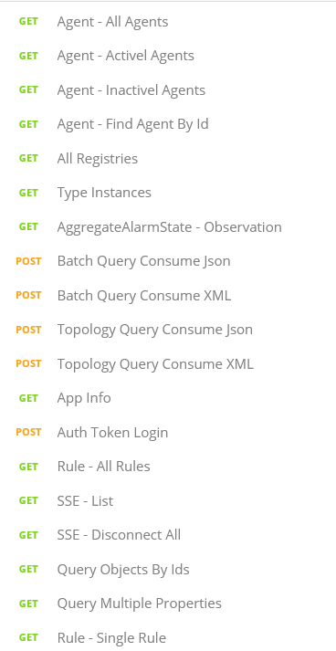
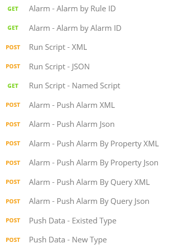

# Foglight Rest API 101 Tutorials

The idea is to create a very basic tutorial for people to get start on using the Foglight Rest API. 

We have a list of sample code repositories for Foglight Rest API already. 

However, if you are new to Foglight Rest API, this will be a good starting point. 

## Step #1 - Get Start with Postman

Postman is a tools for people to testing the Rest API and generate the CURL sample code for the API queries. I would recommend start from there so that you could get CURL sample code and test it from there. 

Postman download - https://www.getpostman.com/apps

After downloaded the Postman,  let's import the Foglight collections into Postman to play around it. 

We have a Foglight API collection published on the Postman site. 

Here is the URL - https://www.getpostman.com/collections/efbaade018ffccead0b2

Click above link to import the Postman collection into the existing Postman environment. 

Great. After import, we see all the Foglight Rest API here. 

|                                            |                                            |                                            |
| ------------------------------------------ | ------------------------------------------ | ------------------------------------------ |
|  |  |  |

